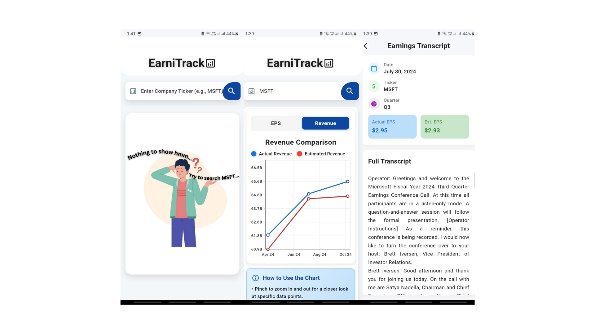

<h1 align="center"> 
  EarniTrack
</h1> <p align="center">
  
</p>

<br/>

<sub>

## 🛠️ Development environment

### 🛠️ Basic environment

Windows:

```
[√] Flutter (Channel stable, 3.22.2, on Microsoft Windows [Version 10.0.22621.3007], locale zh-CN)
[√] Android toolchain -develop for Android devices (Android SDK version 34.0.0)
[√] Visual Studio -develop Windows apps (Visual Studio Community 2022 17.9.6)
[√] Android Studio (version 2023.3)
[√] IntelliJ IDEA Ultimate Edition (version 2024.1)
[√] VS Code (version 1.90.0)
```

macOS:

```
[✓] Flutter (Channel stable, 3.22.2, on macOS 14.4.1 23E224 darwin-x64, locale zh-Hans-CN)
[✓] Android toolchain -develop for Android devices (Android SDK version 34.0.0)
[✓] Xcode -develop for iOS and macOS (Xcode 15.4)
[✓] Android Studio (version 2023.3)
[✓] VS Code (version 1.89.1)
```

## 📖 Setup and Run the App

### Prerequisites

```
- Ensure you have Flutter installed. Follow the instructions [here](https://flutter.dev/docs/get-started/install).
- Install Android Studio for mobile development.
- Install Visual Studio Code or any other preferred IDE.
```

### Setup

1. **Clone the repository**:

   ```sh
   git clone  https://github.com/ArunChapagain/earni_track.git
   cd earni_track
   ```

2. **Install dependencies**:

   ```sh
   flutter pub get
   ```

3. **Set up your development environment**:

```
    - For Android: Ensure you have an Android emulator set up or a physical device connected.
    - For iOS: Ensure you have an iOS simulator set up or a physical device connected.
```

## Running the App

1. **Run on Android**:

   ```sh
   flutter run --debug // for debug mode
   flutter run --release // for release mode
   ```

2. **Run on iOS**:

   ```sh
   flutter run
   ```

3. **Run on Web**:
   ```sh
   flutter run -d chrome
   ```

## 🌏 Related websites

> Flutter official website: [https://flutter.dev/](https://flutter.dev/)
> Packages (original site): [https://pub.dev/](https://pub.dev/)
